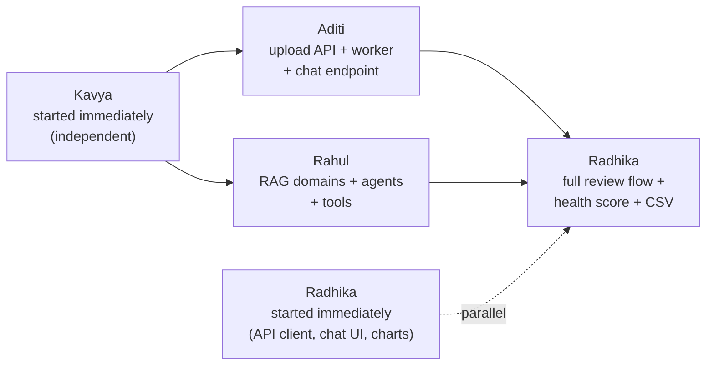
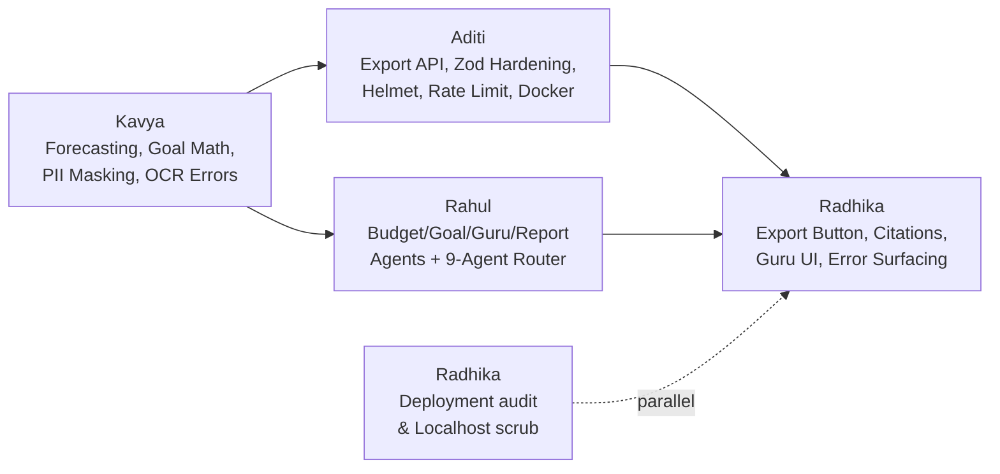

<div align="center">

# FinSage AI

### Agentic AI-powered Smart Wealth Management Platform

*A 4-person team, one repository, four owned domains.*


</div>

---

## Where we are

| Phase | Focus | Status |
|:---|:---|:---:|
| **Phase 1** | Foundation — Docker infra, auth, AI engine skeleton, dashboard shell | Done |
| **Phase 2** | Core Features — Transactions, Budgets, Goals, first AI tool | Done |
| **Phase 3** | AI + Documents — OCR pipeline, RAG, agents, AI Advisor chat | Done |
| **Phase 4** | Advanced Intelligence & Production Readiness — Budget/Goal/Guru/Report Agents, Export, Security Hardening, OCR Error Surfacing, Forecasting | **Done** |
| **Phase 5** | Cloud Deployment & Scale — Production hosting (Vercel + Container PaaS), CI/CD, live database & monitoring | Planned |

> Phases 1 through 4 are complete and fully integrated end to end — auth,
> real-time document OCR with error surfacing, 9-agent AI supervisor routing,
> RAG citations, export functionality, and security hardening are live. See
> **[Phase 4 — What We Built](#phase-4--what-we-built)** below for the
> complete implementation breakdown.

<details>
<summary><b>Phase 1 recap — what was built first</b></summary>
<br>

Docker infra (PostgreSQL + pgvector, Redis), the Node/Express BFF with JWT
auth and a live health-check endpoint, the Python FastAPI AI engine with a
working Supervisor agent, Kavya's first deterministic analytics functions
(CSV parsing, monthly spending, an OCR prototype), and the Next.js
dashboard shell — all four layers connected and verified end to end.

</details>

<details>
<summary><b>Phase 2 recap — Core Features</b></summary>
<br>

Full CRUD APIs for Transactions, Expenses, Budgets, and Goals on a
persisted PostgreSQL schema; a Monthly Salary field and card replacing the
old placeholder "Net Worth" card; the Supervisor agent's first routing
logic and LangChain tool; and live Dashboard/Transactions/Budgets/Goals
pages consuming all of it, styled around a "passbook ledger" visual
identity (serif tabular numerals, hairline dividers).

</details>

<details>
<summary><b>Phase 3 recap — AI + Documents</b></summary>
<br>

Full async OCR and document extraction pipeline powered by Redis background
workers and FastAPI/Pandas; ML-based categorization; financial health score
and spending anomaly detection; mock Splitwise shared-expense integration;
real RAG knowledge domains in pgvector; and an interactive AI Advisor
chat interface with Server-Sent Events (SSE) token streaming.

</details>

<details open>
<summary><b>Phase 4 recap — Advanced Intelligence & Production Readiness</b></summary>
<br>

Formalized Budget and Goal agents alongside a Guru Comparison Agent and
deterministic Report Agent; streamlined 9-agent Supervisor routing; naive
moving-average expense forecasting and realistic goal completion projections;
BFF report export endpoint (`GET /api/v1/reports/export`) with native
Markdown download on the Dashboard; human-readable document error surfacing
and OCR failure safety; robust Indian PII masking (PAN, Aadhaar, account
numbers); global security hardening (Helmet, auth rate limiting); database
performance indexing; and Next.js / BFF container deployment preparation.

</details>

---

## Team & ownership

| | Person | Folder | Stack |
|:---|:---|:---|:---|
| **P1** | **Aditi** | `apps/bff-server/` | Node.js · Express · TypeScript · Prisma · PostgreSQL · Redis |
| **P2** | **Rahul** | `apps/ai-engine/app/{agents,rag,tools,graph,services}` | Python · FastAPI · LangChain · LangGraph · Gemini/Groq |
| **P3** | **Kavya** | `apps/ai-engine/app/{analytics,documents,adapters}` | Python · Pandas · OCR · PostgreSQL |
| **P4** | **Radhika** | `apps/web/` | Next.js · TypeScript · Tailwind CSS |

> **Shared-file rule:** Rahul and Kavya share the `ai-engine` FastAPI app
> but never touch each other's subfolders. `app/main.py` is the one shared
> entrypoint, owned by Rahul.

---

## What's working (Phase 1-4)

| Feature | Detail |
|:---|:---|
| **Auth & Security** | JWT auth, bcrypt hashing, Helmet HTTP headers, IP rate limiting on `/auth/*` |
| **Monthly Salary** | Set/edit monthly income, persisted in PostgreSQL with live cash retention stats |
| **Transactions** | Full CRUD, scoped per user, paginated, filterable by category & date; indexed on `(userId, transactionDate)` |
| **Expenses & Forecast** | Category-breakdown summary + naive moving-average expense forecasting per category |
| **Budgets & Variance** | Monthly limit per category with live variance vs. real spend and visual progress gauges |
| **Goals & Projections** | Target-date savings goals with real projected completion dates based on net savings |
| **Documents Vault** | Async OCR/parsing pipeline, multi-format (PDF/PNG/JPG/CSV), human-readable error surfacing |
| **AI Advisor & Citations** | Dedicated full-page copilot with SSE streaming, expandable RAG citations (`✦ Sources (N) +`) |
| **Guru Perspectives** | Contrasting multi-agent investment advice (Safe, Growth, Balanced) or single grounded guidance |
| **Executive Reports** | Deterministic financial report generation and native Markdown download (`.md`) |
| **PII Protection** | Automatic regex redaction of Indian PAN, Aadhaar, and account numbers prior to LLM calls |
| **Frontend Experience** | Premium Gen-Z fintech UI, fully responsive (desktop to 390px mobile), zero mock data |
| **Deployment Ready** | Standard Vercel-ready Next.js app with `NEXT_PUBLIC_BFF_URL` and containerized BFF Dockerfile |

---

## Folder structure

```
finsage-ai/
├── docker-compose.yml        # Postgres (pgvector) + Redis
├── apps/
│   ├── bff-server/            # Aditi — Node/Express/Prisma
│   │   ├── prisma/schema.prisma
│   │   └── src/
│   │       ├── routes/        # auth, transactions, expenses, budgets, goals, documents, advisor, users, health
│   │       ├── controllers/
│   │       ├── workers/       # document-processing queue consumer
│   │       ├── middleware/    # JWT auth guard
│   │       └── lib/           # prisma + redis clients
│   ├── ai-engine/             # Rahul + Kavya — Python/FastAPI
│   │   └── app/
│   │       ├── agents/, graph/, services/, rag/, tools/, schemas/   # Rahul
│   │       └── analytics/, documents/, adapters/                    # Kavya
│   └── web/                   # Radhika — Next.js
│       ├── app/                # dashboard, transactions, budgets, goals, documents, advisor pages
│       ├── components/         # Navbar, Sidebar, Card, AuthGate, SalaryCard, OverviewCards, TransactionsTable, BudgetCard, GoalCard, DocumentUpload, AdvisorChat
│       └── lib/api.ts          # single BFF client
```

---

## Running it locally

<details open>
<summary><b>1. Start shared infrastructure</b></summary>

```bash
docker compose up -d
docker ps        # confirm finsage-postgres and finsage-redis are Up
```
</details>

<details open>
<summary><b>2. Backend — Aditi</b></summary>

```bash
cd apps/bff-server
cp .env.example .env          # first time only
npm install
npx prisma migrate dev        # applies all migrations through Phase 3
npm run dev                   # -> http://localhost:4000

# in a second terminal — the document-processing worker
npm run worker
```
</details>

<details open>
<summary><b>3. AI engine — Rahul + Kavya</b></summary>

```bash
cd apps/ai-engine
cp .env.example .env          # first time only — add GROQ_API_KEY or GEMINI_API_KEY if you have one
python -m venv venv && source venv/bin/activate   # Windows: venv\Scripts\activate
pip install -r requirements.txt
uvicorn app.main:app --reload --port 8000   # -> http://localhost:8000/docs
```
</details>

<details open>
<summary><b>4. Frontend — Radhika</b></summary>

```bash
cd apps/web
cp .env.local.example .env.local   # first time only
npm install
npm run dev                   # -> http://localhost:3000
```
</details>

### Try it end to end

1. Open `http://localhost:3000/transactions`, register a demo user.
2. Add a transaction — it appears in the table instantly.
3. Set a budget on `/budgets`, add a transaction in that category, confirm
   the spend bar updates.
4. Add a goal on `/goals`.
5. Upload a receipt on `/documents`, watch its status move to
   Completed/Needs Review, and confirm the extracted transaction.
6. Ask the AI Advisor a spending question on `/advisor` and watch the
   reply stream in.

<details>
<summary><b>Verifying Postgres & Redis directly</b></summary>
<br>

**Postgres:**
```bash
docker exec -it finsage-postgres psql -U finsage -d finsage_db
\dt        -- should list: users, accounts, transactions, budgets, goals, documents
```

**Redis:**
```bash
docker exec -it finsage-redis redis-cli
PING       -- should reply PONG
LLEN document-processing-queue   -- should return to 0 once a job is processed
```
</details>

---

## Completed workflows

*Every workflow below was tested end to end through the real UI, hitting
the real BFF API, persisted in PostgreSQL.*

| # | Workflow | Status |
|:---:|:---|:---:|
| 1 | Register -> Login | Complete |
| 2 | Set monthly salary | Complete |
| 3 | Add and view a transaction | Complete |
| 4 | Set a budget and see live variance | Complete |
| 5 | Create a savings goal | Complete |
| 6 | Category-wise expense summary | Complete |
| 7 | AI Supervisor round-trip (spending question) | Complete |
| 8 | Document upload -> OCR/parse -> review -> confirm | Complete |
| 9 | AI Advisor chat with SSE streaming | Complete |
| 10 | Executive Financial Report Export (`GET /api/v1/reports/export`) | Complete |
| 11 | Document processing error surfacing & OCR failure safety | Complete |
| 12 | Guru Perspectives comparison & RAG citations | Complete |

<details>
<summary><b>See the full step-by-step detail for workflows 1-12</b></summary>

### 1. Register -> Login
1. User opens `/transactions` (or `/budgets`, `/goals`) with no session yet.
2. `AuthGate` shows a login/register form.
3. User registers with name, email, password -> `POST /api/v1/auth/register`
   -> BFF hashes the password (bcrypt), creates a `User` row, returns a JWT.
4. Token is stored in `localStorage`; the page reloads and the form is
   replaced by the real page content.
5. On a later visit, the same user logs in with email/password ->
   `POST /api/v1/auth/login` -> same JWT flow with brute-force rate limiting.

**Status: complete.**

### 2. Set monthly salary
1. On the Dashboard, user enters a monthly salary and saves ->
   `PATCH /api/v1/users/me/salary`.
2. BFF validates and updates the `User` row.
3. Value displays with tabular-numeral currency formatting and survives a
   page refresh.

**Status: complete.**

### 3. Add and view a transaction
1. From `/transactions`, user fills in amount, description, category and
   clicks Add -> `POST /api/v1/transactions` (JWT-authenticated).
2. BFF validates the payload with tightened Zod schemas (rejects negative amounts,
   enforces max description lengths), writes a `Transaction` row scoped to
   `userId`, returns the created record.
3. Frontend re-fetches the list -> `GET /api/v1/transactions` -> the new
   transaction appears in the table immediately, newest first.
4. Transaction is deletable from the same row -> `DELETE /api/v1/transactions/:id`.

**Status: complete.**

### 4. Set a budget and see live variance
1. From `/budgets`, user picks a category and a monthly limit, clicks
   "Set budget" -> `POST /api/v1/budgets`.
2. User adds a transaction in that same category (workflow 3).
3. `/budgets` re-fetches -> `GET /api/v1/budgets/variance` -> BFF sums
   this month's transactions per category and returns `{ limit, spent,
   remaining }` per budget.
4. UI renders circular gauges and progress bars per category; the bar turns
   rose/orange once spend approaches or exceeds the limit.

**Status: complete.**

### 5. Create a savings goal
1. From `/goals`, user enters a title, target amount, and target date,
   clicks "Add goal" -> `POST /api/v1/goals`.
2. BFF creates a `Goal` row scoped to the user.
3. `/goals` re-fetches -> `GET /api/v1/goals` -> the new goal appears in
   the list with its target amount, deadline, and real completion projection math.
4. Goal is deletable -> `DELETE /api/v1/goals/:id`.

**Status: complete.**

### 6. Category-wise expense summary
1. Any client can call `GET /api/v1/expenses/summary` (optionally with
   `?month=YYYY-MM`) once transactions exist.
2. BFF groups the user's transactions by category via Prisma's `groupBy`,
   returning per-category totals, counts, and an overall total.

**Status: complete.**

### 7. AI Supervisor round-trip (spending question)
1. A message plus the user's transactions (as JSON) is sent to
   `POST /internal/ai/orchestrate` on the AI engine.
2. The 9-agent Supervisor router routes spending queries to the `ExpenseAgent`,
   which executes `get_spending_summary` and formats the answer.
3. Response returns `{ answer, metrics, agent_path }` to the caller.

**Status: complete.**

### 8. Document upload -> OCR/parse -> review -> confirm
1. User drops or selects a receipt, invoice, or statement on `/documents`.
2. `POST /api/v1/documents/upload` stores the file path, creates a `Document`
   record in `PROCESSING` state, and pushes a job to Redis `document-processing-queue`.
3. Background worker consumes the queue, calls `POST /internal/documents/process`,
   and extracts normalized rows with confidence scores.
4. If confidence is high (>= 0.85), an idempotent transaction is created automatically;
   otherwise status moves to `NEEDS_REVIEW`.
5. User reviews extracted items in the interactive review modal, corrects any
   unclear values, and clicks "Confirm all to Ledger" -> `POST /api/v1/documents/:id/confirm`.

**Status: complete.**

### 9. AI Advisor chat with SSE streaming
1. User asks financial advice questions on the dedicated `/advisor` chat interface.
2. Frontend initiates `POST /api/v1/advisor/chat` with SSE streaming.
3. AI engine routes via Supervisor graph to the appropriate agent (Expense, Budget,
   Goal, Analytics, RAG Advisor, or Guru Agent).
4. Tokens stream back word-by-word with typing effect, terminating with
   optional `[CITATIONS]` and `[DONE]` events.

**Status: complete.**

### 10. Executive Financial Report Export
1. User clicks "Export Report" in the Dashboard header.
2. Frontend calls `GET /api/v1/reports/export` with JWT authentication.
3. BFF gathers past 3 months of transactions, budgets, goals, and health scores,
   then delegates to AI engine `POST /internal/reports/generate`.
4. Report Agent deterministically calculates category totals, budget variances,
   and goal milestones into an executive Markdown memorandum (`# FinSage AI — Executive Financial Memorandum`).
5. BFF returns Markdown with `Content-Disposition: attachment; filename="FinSage-Financial-Report.md"`.
6. Frontend triggers a clean browser download via Blob and programmatic `<a>` click.

**Status: complete.**

### 11. Document processing error surfacing & OCR failure safety
1. If an unreadable, corrupted, or unsupported document is uploaded, backend
   assigns `FAILED` status and returns an explicit `ocrError` message.
2. Frontend surfaces this in the document status area with a compact
   `⚠ NEEDS ATTENTION` card in FinSage rose styling (`#FFF1F2`).
3. Long messages gracefully truncate with `Show details` / `Show less` toggle.
4. Unreadable amounts are flagged with `Unreadable in scan` and placeholder `0.00`,
   preventing misleading `₹0` values from being recorded as extracted amounts.
5. User can click "Review" to manually enter valid transaction values and confirm.

**Status: complete.**

### 12. Guru Perspectives comparison & RAG citations
1. User asks philosophical or contrasting investment questions (e.g. saving vs investing).
2. AI Supervisor routes to the `GuruAgent`, which retrieves knowledge from `guru_philosophy`.
3. When multiple views are returned (Safe, Growth, Balanced), the UI renders distinct,
   color-coded perspective cards side-by-side or stacked.
4. When a single grounded answer is returned, UI gracefully renders one polished card.
5. Retrieved citations render immediately below the message as a compact collapsed
   control (`✦ Sources (N) +`) that expands to show source titles, authors, and text snippets.

**Status: complete.**

</details>

---

## API endpoints

> All routes below except `/health` and `/auth/*` require
> `Authorization: Bearer <token>`.

<details open>
<summary><b>Auth, users & health</b></summary>

| Method | Endpoint | Description |
|:---|:---|:---|
| `GET` | `/api/v1/health` | BFF + Postgres + Redis status |
| `POST` | `/api/v1/auth/register` | Create a user, returns JWT |
| `POST` | `/api/v1/auth/login` | Returns JWT |
| `GET` | `/api/v1/users/me` | Get profile + monthly salary |
| `PATCH` | `/api/v1/users/me/salary` | Set/update monthly salary |
</details>

<details open>
<summary><b>Transactions & expenses</b></summary>

| Method | Endpoint | Description |
|:---|:---|:---|
| `GET` | `/api/v1/transactions` | List transactions (paginated, filterable) |
| `POST` | `/api/v1/transactions` | Create a transaction |
| `PATCH` | `/api/v1/transactions/:id` | Update a transaction |
| `DELETE` | `/api/v1/transactions/:id` | Delete a transaction |
| `POST` | `/api/v1/transactions/import-csv` | Bulk-import transactions from a CSV file |
| `GET` | `/api/v1/expenses/summary` | Category totals, optional `?month=YYYY-MM` |
</details>

<details open>
<summary><b>Budgets & goals</b></summary>

| Method | Endpoint | Description |
|:---|:---|:---|
| `GET` | `/api/v1/budgets` | List budgets |
| `GET` | `/api/v1/budgets/variance` | Budget vs. actual spend this month |
| `POST` | `/api/v1/budgets` | Create/update a budget for a category |
| `DELETE` | `/api/v1/budgets/:id` | Delete a budget |
| `GET` | `/api/v1/goals` | List goals |
| `POST` | `/api/v1/goals` | Create a goal |
| `DELETE` | `/api/v1/goals/:id` | Delete a goal |
</details>

<details open>
<summary><b>Documents, Reports & AI Advisor (Phases 3-4)</b></summary>

| Method | Endpoint | Description |
|:---|:---|:---|
| `POST` | `/api/v1/documents/upload` | Upload a receipt/statement for processing |
| `GET` | `/api/v1/documents` | List the user's documents |
| `GET` | `/api/v1/documents/:id` | Single document status + extracted data |
| `POST` | `/api/v1/documents/:id/confirm` | Confirm reviewed transactions from a document |
| `POST` | `/api/v1/advisor/chat` | AI Advisor chat, streamed via SSE with citations |
| `POST` | `/api/v1/knowledge/upload` | Upload financial book/article text for the guru-advice system |
| `GET` | `/api/v1/analytics/health-score` | Financial health score |
| `GET` | `/api/v1/reports/export` | Download executive financial report in Markdown format (`.md`) |
</details>

<details>
<summary><b>Internal (AI-engine-only, called by the BFF, not the browser)</b></summary>

| Method | Endpoint | Description |
|:---|:---|:---|
| `POST` | `/internal/ai/orchestrate` | 9-agent supervisor routing & graph execution |
| `POST` | `/internal/reports/generate` | Assembles deterministic financial report markdown |
| `POST` | `/internal/analytics/normalize` | Normalizes and categorizes raw transaction rows |
| `POST` | `/internal/analytics/category-breakdown` | Category spend totals & percentage share |
| `POST` | `/internal/documents/process` | Multi-format OCR, parsing & confidence scoring |
| `POST` | `/internal/rag/search` | Vector search across domain knowledge collections |
| `POST` | `/internal/rag/ingest` | Ingests text into pgvector store |
| `POST` | `/internal/analytics/parse-csv-transactions` | Parses raw CSV transactions in chunks |
| `POST` | `/internal/analytics/budget-recommendation` | Dynamic category limits based on spending history |
| `POST` | `/internal/analytics/anomalies` | Statistical outlier detection |
| `POST` | `/internal/analytics/health-score` | Comprehensive financial health score formula |
| `GET` | `/internal/adapters/splitwise/groups/:group_id` | Mock Splitwise shared expenses & balances |
</details>

---

## Known issues fixed along the way

> **Phase 2 — `Functions are not valid as a child of Client Components`**
>
> **Cause:** The Transactions/Budgets/Goals `page.tsx` files were Server
> Components by default, but `AuthGate` passes its `children` as a
> function (a render prop), which can't cross the server-client boundary.
>
> **Fix:** Added `"use client"` to the top of `app/transactions/page.tsx`,
> `app/budgets/page.tsx`, and `app/goals/page.tsx`.

---

## Submission checklist

- [x] **Completed workflows** — 12 end-to-end flows across Phases 1-4 (see table above), tested with real persistence and live API calls.
- [x] **Track A & B: Multi-format Document Processing** — Upload receipts, bank statements, invoices (PDF/PNG/JPG/CSV) with async Redis queue workers and OCR confidence scoring.
- [x] **Track A & B: Spending Visualization & Analytics** — Interactive category charts, monthly spending dynamics, and moving-average category forecasting.
- [x] **Track A & B: Advice Interface & Guru Recommendations** — Dedicated `/advisor` full-page copilot with SSE streaming, expandable RAG citations, and Guru multi-perspective comparisons (`THE SAFE PLAY`, `THE GROWTH PLAY`, `THE BALANCED TAKE`).
- [x] **Track A & B: Budget Tracking & Real Goal Projections** — Category limits with live variance gauges and net-savings projected completion dates.
- [x] **Track A & B: Executive Report Export** — One-click Dashboard "Export Report" button triggering deterministic Markdown memorandum downloads (`.md`).
- [x] **Track A & B: Input Validation & Error Surfacing** — Strict Zod schema constraints (positive numbers, string lengths, valid dates), structured OCR failure handling, and FinSage rose error card presentation (`⚠ NEEDS ATTENTION`).
- [x] **Track B: Modern Financial UX** — Cohesive Gen-Z fintech visual design with warm cream (`#FFFDF8`), deep plum (`#18122B`), and lime accents.
- [x] **Track B: Data Security & PII Protection** — Global Helmet headers, auth brute-force rate limiting, and regex-based redaction of Indian PAN, Aadhaar, and bank account numbers prior to LLM calls.
- [x] **Track B: Performance Safeguards** — Composite database indexing on `(userId, transactionDate)` and chunked CSV processing for large datasets (>5,000 rows).
- [x] **Track B: Cloud Deployment Readiness** — Multi-stage production Dockerfile for BFF server and standard Vercel-ready Next.js 14 frontend verified via `npm run build` with `NEXT_PUBLIC_BFF_URL`.

---

## Phase 3 — What we built

Phase 3 added document intelligence and the AI advisor, and closed the
foundational items on our official Track A/B checklist: advanced multi-format
OCR, ML-based expense categorization, Splitwise group-expense integration,
spending pattern visualization, budgeting/goal-tracking tools, anomaly
detection, custom category learning, and a comprehensive financial health
score.

### Phase 3 build order that was followed



| Step | Owner | What happened |
|:---:|:---|:---|
| 1 | **Kavya** | Started immediately, independent of everyone — confidence scoring, receipt/PDF parsing, the document endpoint, multi-format OCR, ML categorization, a mock Splitwise adapter, CSV parsing, and budget/anomaly/health-score functions. |
| 2 | **Aditi** | Built in parallel — `Document` model, upload API, Redis worker, SSE chat endpoint, CSV import, knowledge upload, health-score proxy. |
| 3 | **Rahul** | Built in parallel — 5 real RAG domains, 4 new agents, budgeting + goal-tracking tools. |
| 4 | **Radhika** | Started immediately on Aditi-only pieces (API client, chat UI, charts); picked up the review flow, health score, and CSV button once Kavya + Aditi landed. |
| 5 | **Integration** | Merged Kavya -> Aditi/Rahul -> Radhika, proving the full pipeline end to end. |
| 6 | **Verification** | Re-tested Phase 1/2, then the full Phase 3 flow: upload -> process -> review -> advise. |

---

## Phase 4 — What we built

Phase 4 elevated FinSage AI into a production-grade, agentic wealth platform.
We formalized the agentic architecture into a 9-agent supervisor router, introduced
contrasting Guru perspectives, built deterministic report generation with native
file export, hardened security with PII redaction and rate limiting, safeguarded
OCR failure handling, added moving-average forecasting, and prepared both frontend
and backend for cloud deployment.

### Phase 4 build order that was followed



| Step | Owner | What happened |
|:---:|:---|:---|
| 1 | **Kavya** | **Forecasting, PII & Performance:** Built moving-average category expense forecasting (`forecast_expenses`); real goal completion date projection math (`calculate_goal_projection`); structured human-readable OCR failure contracts; document file validation (size/type checks); Indian PII masking regex for PAN, Aadhaar, and account numbers; and chunked CSV processing for large datasets (>5,000 rows). |
| 2 | **Aditi** | **Export Endpoint, Validation & Security:** Added `GET /api/v1/reports/export` with Markdown attachment headers; tightened Zod schemas across transactions, budgets, goals, and users; added Helmet security headers; rate-limited `/api/v1/auth/*` against brute-force attacks; added audit logging; created `(userId, transactionDate)` DB composite index; created multi-stage Dockerfile and `.env.production.example`. |
| 3 | **Rahul** | **Agent Formalization & 9-Agent Router:** Created `BudgetAgent` and `GoalAgent` wrapping core tools with LLM explanations; built `GuruAgent` comparing retrieved perspectives from `guru_philosophy`; built deterministic `ReportAgent` (`POST /internal/reports/generate`) assembling unparaphrased financial summaries; and replaced supervisor if/elif branching with a clean 9-agent routing table. |
| 4 | **Radhika** | **Frontend Intelligence & Polish:** Integrated Guru Comparison views (Safe, Growth, Balanced) with single-card fallbacks in `/advisor`; added collapsible per-message RAG citation snippets (`✦ Sources (N) +`); implemented the Dashboard "Export Report" button with native Blob `.md` download; surfaced human-readable document error cards (`⚠ NEEDS ATTENTION`) without fake ₹0 amounts; and cleansed all hardcoded localhost references for Vercel readiness. |
| 5 | **Integration & Verification** | End-to-end integration verified across all 4 domains: real `.md` reports downloaded, citation snippets expanded, failed documents accurately surfaced in the UI, and Next.js 14 production build verified with 0 errors. |

---

## Phase 5 — Planned

Phase 5 focuses on live cloud deployment, infrastructure scaling, and automated production operations:

| Objective | Scope |
|:---|:---|
| **Cloud Hosting Deployment** | Deploy `apps/web` to Vercel and `apps/bff-server` + `apps/ai-engine` to containerized PaaS (Render / Railway / Fly.io / AWS ECS). |
| **Managed Cloud Data** | Transition from local Docker to managed serverless PostgreSQL with pgvector (Neon / Supabase) and Upstash Redis. |
| **Automated CI/CD** | GitHub Actions workflows for automated linting, type-checking, Docker builds, and preview deployments. |
| **Production Observability** | Sentry error monitoring, structured JSON logging, and API latency performance telemetry. |
| **Deliverables & Demo** | Final 8-10 minute comprehensive video walkthrough and detailed user financial planning guide. |
