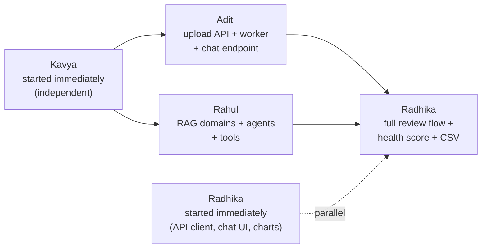

<div align="center">

# FinSage AI

### Agentic AI-powered Smart Wealth Management Platform

*A 4-person team, one repository, four owned domains.*


</div>

---

## Where we are

| Phase | Focus | Status |
|:---|:---|:---:|
| **Phase 1** | Foundation — Docker infra, auth, AI engine skeleton, dashboard shell | Done |
| **Phase 2** | Core Features — Transactions, Budgets, Goals, first AI tool | Done |
| **Phase 3** | AI + Documents — OCR pipeline, RAG, agents, AI Advisor chat | **Done** |
| **Phase 4** | Not yet scoped | Planned |

> Phase 1 and 2's foundations are unchanged underneath Phase 3 — auth,
> health checks, transactions/budgets/goals, and the core AI engine all
> still run exactly as built. See
> **[Phase 3 — What We Built](#phase-3--what-we-built)** below for the
> detailed build order that was followed.

<details>
<summary><b>Phase 1 recap — what was built first</b></summary>
<br>

Docker infra (PostgreSQL + pgvector, Redis), the Node/Express BFF with JWT
auth and a live health-check endpoint, the Python FastAPI AI engine with a
working Supervisor agent, Kavya's first deterministic analytics functions
(CSV parsing, monthly spending, an OCR prototype), and the Next.js
dashboard shell — all four layers connected and verified end to end.

</details>

<details>
<summary><b>Phase 2 recap — Core Features</b></summary>
<br>

Full CRUD APIs for Transactions, Expenses, Budgets, and Goals on a
persisted PostgreSQL schema; a Monthly Salary field and card replacing the
old placeholder "Net Worth" card; the Supervisor agent's first routing
logic and LangChain tool; and live Dashboard/Transactions/Budgets/Goals
pages consuming all of it, styled around a "passbook ledger" visual
identity (serif tabular numerals, hairline dividers).

</details>

---

## Team & ownership

| | Person | Folder | Stack |
|:---|:---|:---|:---|
| **P1** | **Aditi** | `apps/bff-server/` | Node.js · Express · TypeScript · Prisma · PostgreSQL · Redis |
| **P2** | **Rahul** | `apps/ai-engine/app/{agents,rag,tools,graph,services}` | Python · FastAPI · LangChain · LangGraph · Gemini/Groq |
| **P3** | **Kavya** | `apps/ai-engine/app/{analytics,documents,adapters}` | Python · Pandas · OCR · PostgreSQL |
| **P4** | **Radhika** | `apps/web/` | Next.js · TypeScript · Tailwind CSS |

> **Shared-file rule:** Rahul and Kavya share the `ai-engine` FastAPI app
> but never touch each other's subfolders. `app/main.py` is the one shared
> entrypoint, owned by Rahul.

---

## What's working (Phase 1-3)

| Feature | Detail |
|:---|:---|
| **Auth** | Register/login issuing a JWT |
| **Monthly Salary** | Set/edit monthly income, persisted in PostgreSQL |
| **Transactions** | Full CRUD, scoped per user, paginated, filterable by category & date |
| **Expenses** | Category-breakdown summary |
| **Budgets** | Monthly limit per category with live variance vs. real spend |
| **Goals** | Savings goals with title, target amount, and deadline |
| **Frontend** | Dashboard/Transactions/Budgets/Goals consuming live BFF data — zero mock data |
| **AI engine** | Supervisor routes between general replies and tool calls; RAG foundation (pgvector + embeddings) in place |
| **Documents** *(Phase 3)* | Upload + async OCR/parsing pipeline with review flow |
| **AI Advisor** *(Phase 3)* | Chat UI with SSE streaming, grounded in retrieved knowledge |

---

## Folder structure

```
finsage-ai/
├── docker-compose.yml        # Postgres (pgvector) + Redis
├── apps/
│   ├── bff-server/            # Aditi — Node/Express/Prisma
│   │   ├── prisma/schema.prisma
│   │   └── src/
│   │       ├── routes/        # auth, transactions, expenses, budgets, goals, documents, advisor, users, health
│   │       ├── controllers/
│   │       ├── workers/       # document-processing queue consumer
│   │       ├── middleware/    # JWT auth guard
│   │       └── lib/           # prisma + redis clients
│   ├── ai-engine/             # Rahul + Kavya — Python/FastAPI
│   │   └── app/
│   │       ├── agents/, graph/, services/, rag/, tools/, schemas/   # Rahul
│   │       └── analytics/, documents/, adapters/                    # Kavya
│   └── web/                   # Radhika — Next.js
│       ├── app/                # dashboard, transactions, budgets, goals, documents, advisor pages
│       ├── components/         # Navbar, Sidebar, Card, AuthGate, SalaryCard, OverviewCards, TransactionsTable, BudgetCard, GoalCard, DocumentUpload, AdvisorChat
│       └── lib/api.ts          # single BFF client
```

---

## Running it locally

<details open>
<summary><b>1. Start shared infrastructure</b></summary>

```bash
docker compose up -d
docker ps        # confirm finsage-postgres and finsage-redis are Up
```
</details>

<details open>
<summary><b>2. Backend — Aditi</b></summary>

```bash
cd apps/bff-server
cp .env.example .env          # first time only
npm install
npx prisma migrate dev        # applies all migrations through Phase 3
npm run dev                   # -> http://localhost:4000

# in a second terminal — the document-processing worker
npm run worker
```
</details>

<details open>
<summary><b>3. AI engine — Rahul + Kavya</b></summary>

```bash
cd apps/ai-engine
cp .env.example .env          # first time only — add GROQ_API_KEY or GEMINI_API_KEY if you have one
python -m venv venv && source venv/bin/activate   # Windows: venv\Scripts\activate
pip install -r requirements.txt
uvicorn app.main:app --reload --port 8000   # -> http://localhost:8000/docs
```
</details>

<details open>
<summary><b>4. Frontend — Radhika</b></summary>

```bash
cd apps/web
cp .env.local.example .env.local   # first time only
npm install
npm run dev                   # -> http://localhost:3000
```
</details>

### Try it end to end

1. Open `http://localhost:3000/transactions`, register a demo user.
2. Add a transaction — it appears in the table instantly.
3. Set a budget on `/budgets`, add a transaction in that category, confirm
   the spend bar updates.
4. Add a goal on `/goals`.
5. Upload a receipt on `/documents`, watch its status move to
   Completed/Needs Review, and confirm the extracted transaction.
6. Ask the AI Advisor a spending question on `/advisor` and watch the
   reply stream in.

<details>
<summary><b>Verifying Postgres & Redis directly</b></summary>
<br>

**Postgres:**
```bash
docker exec -it finsage-postgres psql -U finsage -d finsage_db
\dt        -- should list: users, accounts, transactions, budgets, goals, documents
```

**Redis:**
```bash
docker exec -it finsage-redis redis-cli
PING       -- should reply PONG
LLEN document-processing-queue   -- should return to 0 once a job is processed
```
</details>

---

## Completed workflows

*Every workflow below was tested end to end through the real UI, hitting
the real BFF API, persisted in PostgreSQL.*

| # | Workflow | Status |
|:---:|:---|:---:|
| 1 | Register -> Login | Complete |
| 2 | Set monthly salary | Complete |
| 3 | Add and view a transaction | Complete |
| 4 | Set a budget and see live variance | Complete |
| 5 | Create a savings goal | Complete |
| 6 | Category-wise expense summary | Complete |
| 7 | AI Supervisor round-trip (spending question) | Complete |
| 8 | Document upload -> OCR/parse -> review -> confirm | *(add detail below)* |
| 9 | AI Advisor chat with SSE streaming | *(add detail below)* |

<details>
<summary><b>See the full step-by-step detail for workflows 1-7</b></summary>

### 1. Register -> Login
1. User opens `/transactions` (or `/budgets`, `/goals`) with no session yet.
2. `AuthGate` shows a login/register form.
3. User registers with name, email, password -> `POST /api/v1/auth/register`
   -> BFF hashes the password (bcrypt), creates a `User` row, returns a JWT.
4. Token is stored in `localStorage`; the page reloads and the form is
   replaced by the real page content.
5. On a later visit, the same user logs in with email/password ->
   `POST /api/v1/auth/login` -> same JWT flow.

**Status: complete.**

### 2. Set monthly salary
1. On the Dashboard, user enters a monthly salary and saves ->
   `PATCH /api/v1/users/me/salary`.
2. BFF validates and updates the `User` row.
3. Value displays with tabular-numeral currency formatting and survives a
   page refresh.

**Status: complete.**

### 3. Add and view a transaction
1. From `/transactions`, user fills in amount, description, category and
   clicks Add -> `POST /api/v1/transactions` (JWT-authenticated).
2. BFF validates the payload (zod), writes a `Transaction` row scoped to
   `userId`, returns the created record.
3. Frontend re-fetches the list -> `GET /api/v1/transactions` -> the new
   transaction appears in the table immediately, newest first.
4. Transaction is deletable from the same row -> `DELETE /api/v1/transactions/:id`.

**Status: complete.**

### 4. Set a budget and see live variance
1. From `/budgets`, user picks a category and a monthly limit, clicks
   "Set budget" -> `POST /api/v1/budgets`.
2. User adds a transaction in that same category (workflow 3).
3. `/budgets` re-fetches -> `GET /api/v1/budgets/variance` -> BFF sums
   this month's transactions per category and returns `{ limit, spent,
   remaining }` per budget.
4. UI renders a progress bar per category; the bar turns red once spend
   exceeds the limit.

**Status: complete.**

### 5. Create a savings goal
1. From `/goals`, user enters a title, target amount, and target date,
   clicks "Add goal" -> `POST /api/v1/goals`.
2. BFF creates a `Goal` row scoped to the user.
3. `/goals` re-fetches -> `GET /api/v1/goals` -> the new goal appears in
   the list with its target amount and deadline.
4. Goal is deletable -> `DELETE /api/v1/goals/:id`.

**Status: complete.**

### 6. Category-wise expense summary
1. Any client can call `GET /api/v1/expenses/summary` (optionally with
   `?month=YYYY-MM`) once transactions exist.
2. BFF groups the user's transactions by category via Prisma's `groupBy`,
   returning per-category totals, counts, and an overall total.

**Status: complete.**

### 7. AI Supervisor round-trip (spending question)
1. A message plus the user's transactions (as JSON) is sent to
   `POST /internal/ai/orchestrate` on the AI engine.
2. The Supervisor agent detects spending-related keywords, calls the
   `get_spending_summary` LangChain tool, which runs Kavya's deterministic
   `calculate_monthly_spending()` against the transactions.
3. The numeric summary is handed to the LLM to produce a short
   natural-language explanation.
4. Response returns `{ answer, metrics, agent_path }` to the caller.

**Status: complete at the API level.**

</details>

> **Workflows 8 and 9 (document processing and the AI Advisor chat) are
> marked complete but not yet written up in full step-by-step detail here
> — share the same kind of implementation summary you gave for the
> Monthly Salary feature and I'll fill in their sections, plus tick off
> the specific Track A/B checklist items they close out.**

---

## API endpoints

> All routes below except `/health` and `/auth/*` require
> `Authorization: Bearer <token>`.

<details open>
<summary><b>Auth, users & health</b></summary>

| Method | Endpoint | Description |
|:---|:---|:---|
| `GET` | `/api/v1/health` | BFF + Postgres + Redis status |
| `POST` | `/api/v1/auth/register` | Create a user, returns JWT |
| `POST` | `/api/v1/auth/login` | Returns JWT |
| `GET` | `/api/v1/users/me` | Get profile + monthly salary |
| `PATCH` | `/api/v1/users/me/salary` | Set/update monthly salary |
</details>

<details open>
<summary><b>Transactions & expenses</b></summary>

| Method | Endpoint | Description |
|:---|:---|:---|
| `GET` | `/api/v1/transactions` | List transactions (paginated, filterable) |
| `POST` | `/api/v1/transactions` | Create a transaction |
| `PATCH` | `/api/v1/transactions/:id` | Update a transaction |
| `DELETE` | `/api/v1/transactions/:id` | Delete a transaction |
| `POST` | `/api/v1/transactions/import-csv` | Bulk-import transactions from a CSV file |
| `GET` | `/api/v1/expenses/summary` | Category totals, optional `?month=YYYY-MM` |
</details>

<details open>
<summary><b>Budgets & goals</b></summary>

| Method | Endpoint | Description |
|:---|:---|:---|
| `GET` | `/api/v1/budgets` | List budgets |
| `GET` | `/api/v1/budgets/variance` | Budget vs. actual spend this month |
| `POST` | `/api/v1/budgets` | Create/update a budget for a category |
| `DELETE` | `/api/v1/budgets/:id` | Delete a budget |
| `GET` | `/api/v1/goals` | List goals |
| `POST` | `/api/v1/goals` | Create a goal |
| `DELETE` | `/api/v1/goals/:id` | Delete a goal |
</details>

<details open>
<summary><b>Documents & AI Advisor (Phase 3)</b></summary>

| Method | Endpoint | Description |
|:---|:---|:---|
| `POST` | `/api/v1/documents/upload` | Upload a receipt/statement for processing |
| `GET` | `/api/v1/documents` | List the user's documents |
| `GET` | `/api/v1/documents/:id` | Single document status + extracted data |
| `POST` | `/api/v1/documents/:id/confirm` | Confirm reviewed transactions from a document |
| `POST` | `/api/v1/advisor/chat` | AI Advisor chat, streamed via SSE |
| `POST` | `/api/v1/knowledge/upload` | Upload financial book/article text for the guru-advice system |
| `GET` | `/api/v1/analytics/health-score` | Financial health score |
</details>

<details>
<summary><b>Internal (AI-engine-only, called by the BFF, not the browser)</b></summary>

| Method | Endpoint |
|:---|:---|
| `POST` | `/internal/ai/orchestrate` |
| `POST` | `/internal/analytics/normalize` |
| `POST` | `/internal/analytics/category-breakdown` |
| `POST` | `/internal/documents/process` |
| `POST` | `/internal/rag/search` |
| `POST` | `/internal/rag/ingest` |
| `POST` | `/internal/analytics/parse-csv-transactions` |
| `POST` | `/internal/analytics/budget-recommendation` |
| `POST` | `/internal/analytics/anomalies` |
| `POST` | `/internal/analytics/health-score` |
| `GET` | `/internal/adapters/splitwise/groups/:group_id` |
</details>

---

## Known issues fixed along the way

> **Phase 2 — `Functions are not valid as a child of Client Components`**
>
> **Cause:** The Transactions/Budgets/Goals `page.tsx` files were Server
> Components by default, but `AuthGate` passes its `children` as a
> function (a render prop), which can't cross the server-client boundary.
>
> **Fix:** Added `"use client"` to the top of `app/transactions/page.tsx`,
> `app/budgets/page.tsx`, and `app/goals/page.tsx`.

---

## Submission checklist

- [x] **Completed workflows** — 9 end-to-end flows across Phases 1-3
      (see table above); 7 fully detailed, 2 pending a written summary.
- [x] **Working API endpoints** — all routes above tested and returning
      correct status codes and shapes.
- [x] **Interactive UI/UX** — delete actions, loading states, inline
      success feedback, logout, disabled-state buttons, document upload
      with live status, and streaming chat.

---

## Phase 3 — What we built

Phase 3 added document intelligence and the AI advisor, and closed the
remaining items on our official Track A/B checklist: advanced multi-format
OCR, ML-based expense categorization, Splitwise group-expense integration,
spending pattern visualization, budgeting/goal-tracking tools, anomaly
detection, custom category learning, and a comprehensive financial health
score. Full implementation prompts and the checklist-to-owner mapping are
in `FinSage_AI_Phase3_Plan_And_Prompts.docx`.

### Build order that was followed



| Step | Owner | What happened |
|:---:|:---|:---|
| 1 | **Kavya** | Started immediately, independent of everyone — confidence scoring, receipt/PDF parsing, the document endpoint, multi-format OCR, ML categorization, a mock Splitwise adapter, CSV parsing, and budget/anomaly/health-score functions. |
| 2 | **Aditi** | Built in parallel — `Document` model, upload API, Redis worker, SSE chat endpoint, CSV import, knowledge upload, health-score proxy. |
| 3 | **Rahul** | Built in parallel — 5 real RAG domains, 4 new agents, budgeting + goal-tracking tools. |
| 4 | **Radhika** | Started immediately on Aditi-only pieces (API client, chat UI, charts); picked up the review flow, health score, and CSV button once Kavya + Aditi landed. |
| 5 | **Integration** | Merged Kavya -> Aditi/Rahul -> Radhika, proving the full pipeline end to end. |
| 6 | **Verification** | Re-tested Phase 1/2, then the full Phase 3 flow: upload -> process -> review -> advise. |
| 7 | **Wrap-up** | This README update, demo video, and Phase 4 scoping next. |
