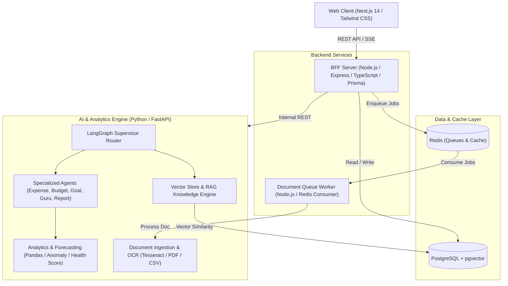

<div align="center">

# FinSage AI

### Agentic AI-powered Smart Wealth Management Platform

*Personalized financial intelligence, automated expense tracking, smart budgeting, and multi-agent advisory.*


</div>

---

## Overview

**FinSage AI** is a comprehensive, production-ready personal wealth management workspace that blends deterministic financial accounting with agentic AI orchestration. It enables individuals and households to track expenses, manage budgets, plan savings goals, ingest multi-format financial documents via OCR, and receive grounded, multi-perspective financial advice powered by retrieval-augmented generation (RAG).

The application is architected as a decoupled multi-service system comprising a modern Next.js frontend, an Express/Prisma Backend-for-Frontend (BFF), an asynchronous Redis worker queue, and a high-performance Python FastAPI AI Engine leveraging LangGraph multi-agent supervisors.

---

## System Architecture


```mermaid
graph TD
    Client["Web Client (Next.js 14 / Tailwind CSS)"]

    subgraph Backend ["Backend Services"]
        BFF["BFF Server (Node.js / Express / TypeScript / Prisma)"]
        Worker["Document Queue Worker (Node.js / Redis Consumer)"]
    end

    subgraph DataStorage ["Data & Cache Layer"]
        PG[("PostgreSQL + pgvector")]
        Redis[("Redis (Queues & Cache)")]
    end

    subgraph AIEngine ["AI & Analytics Engine (Python / FastAPI)"]
        Supervisor["LangGraph Supervisor Router"]
        Agents["Specialized Agents (Expense, Budget, Goal, Guru, Report)"]
        Analytics["Analytics & Forecasting (Pandas / Anomaly / Health Score)"]
        OCR["Document Ingestion & OCR (Tesseract / PDF / CSV)"]
        RAG["Vector Store & RAG Knowledge Engine"]
    end

    Client -->|REST API / SSE| BFF
    BFF -->|Read / Write| PG
    BFF -->|Enqueue Jobs| Redis
    Redis -->|Consume Jobs| Worker
    Worker -->|Process Doc| OCR
    BFF -->|Internal REST| AIEngine
    Supervisor --> Agents
    Supervisor --> RAG
    Agents --> Analytics
    RAG -->|Vector Similarity| PG
```

---

## Core Components

FinSage AI is divided into specialized services, each handling a dedicated domain of the application:

### 1. Web Frontend (`apps/web`)
* **Stack**: Next.js 14 (App Router), TypeScript, Tailwind CSS, Lucide Icons.
* **Responsibilities**:
  * **Interactive Dashboard**: Real-time overview of monthly cashflow, savings rate, dynamic XP progress, user-specific gamification missions, and quick actions.
  * **Transaction Ledger**: Full CRUD ledger supporting category filtering, search, pagination, bulk CSV uploads, and inline category editing.
  * **Smart Budgeting & Variance**: Visual circular spend gauges and real-time category budget tracking with dynamic color-coded limit thresholds.
  * **Financial Goals & Projections**: Target-date savings trackers calculating realistic completion milestones based on historical net cashflow.
  * **Multi-Agent AI Advisor**: Dedicated copilot interface with Server-Sent Events (SSE) token streaming, expandable RAG knowledge citations, and side-by-side Guru investment perspective comparisons.
  * **Document Vault**: Drag-and-drop document upload interface supporting interactive OCR review modals and human-readable error handling.
  * **Household Finance**: Multi-member expense tracking and split calculations for shared living costs.

### 2. Backend-for-Frontend (BFF) Server (`apps/bff-server`)
* **Stack**: Node.js, Express.js, TypeScript, Prisma ORM, JWT, Zod, Helmet.
* **Responsibilities**:
  * **Authentication & Authorization**: Secure JWT-based auth with bcrypt password hashing, input sanitization, and IP rate limiting.
  * **Core Domain APIs**: REST endpoints for transactions, recurring expenses, category budgets, financial goals, gamification, and household ledgers.
  * **Document Orchestration**: Upload handling, multi-part form validation, and job dispatching to Redis queues.
  * **Report Delivery**: Aggregation of multi-month financial metrics and file streaming for downloadable Markdown reports (`GET /api/v1/reports/export`).
  * **Advisor Gateway**: Authenticated streaming proxy bridging client SSE connections with the Python AI Engine.

### 3. Background Document Worker (`apps/bff-server/src/workers`)
* **Stack**: Node.js, Redis, Axios.
* **Responsibilities**:
  * Consumes document processing tasks asynchronously from the Redis queue (`document-processing-queue`).
  * Forwards raw documents to the AI Engine for OCR extraction, normalization, and confidence scoring.
  * Automatically creates ledger transactions for high-confidence items (>= 0.85) or flags documents for user review.

### 4. AI & Analytics Engine (`apps/ai-engine`)
* **Stack**: Python 3.11+, FastAPI, LangChain, LangGraph, Pandas, pgvector, Pydantic.
* **Responsibilities**:
  * **LangGraph Supervisor Routing**: Dynamic intent classification and routing across specialized agents:
    * **ExpenseAgent**: Analyzes historical spending habits and category breakdowns.
    * **BudgetAgent**: Evaluates category utilization and recommends realistic spending caps.
    * **GoalAgent**: Computes target savings timelines and milestone feasibility.
    * **GuruAgent**: Compares investment frameworks (Conservative, Growth, Balanced) using domain knowledge.
    * **ReportAgent**: Generates deterministic executive financial summaries.
  * **Document Processing & OCR**: Multi-format parsing (PDF, PNG, JPG, CSV) with table extraction and confidence rating.
  * **Predictive Analytics**: Moving-average category expense forecasting, anomaly detection, and comprehensive financial health scoring.
  * **Data Privacy & PII Redaction**: Pre-inference regex sanitization for sensitive Indian identifiers (PAN, Aadhaar, bank account numbers).
  * **Domain RAG**: Vector search over curated financial literature and personal financial history using `pgvector`.

---

## Key Features & Capabilities

| Feature | Description |
|:---|:---|
| **Real-Time Financial Dashboard** | Tracks monthly salary, net savings, cash retention rate, and live transaction summaries without mock placeholders. |
| **Passbook Ledger & CSV Import** | Full transaction management with instant search, category tagging, date filters, and bulk CSV ingestion. |
| **Budget Variance Monitoring** | Category-level limits with dynamic progress bars and visual warnings when spend approaches thresholds. |
| **Milestone Goal Projections** | Target savings goals paired with mathematical completion date projections based on actual surplus income. |
| **Asynchronous Document Vault** | Multi-format receipt/invoice OCR pipeline with queue-backed background processing and interactive review flows. |
| **Agentic AI Financial Copilot** | 9-agent supervisor system providing real-time streaming guidance, source citations, and contrasting Guru perspectives. |
| **Household Expense Splitting** | Group finance management for shared living costs, calculating equal splits and member contribution balances. |
| **Gamified Financial Missions** | Dynamic, data-driven financial quests and XP tracking tied to real user activity and budget adherence. |
| **Executive Markdown Export** | One-click export generating comprehensive financial health memorandums formatted for instant download. |
| **Privacy-First Architecture** | Automatic PII masking, strict Zod validation schemas, rate-limited auth endpoints, and hardened security headers. |

---

## Directory Structure

```
FinSage-AI/
├── docker-compose.yml              # Local PostgreSQL (pgvector) and Redis services
├── apps/
│   ├── web/                        # Next.js 14 Frontend
│   │   ├── app/                    # App Router pages (dashboard, transactions, budgets, goals, documents, etc.)
│   │   ├── components/             # Reusable UI components (Navbar, Modals, Cards, Charts, Advisor)
│   │   ├── lib/                    # API clients and utilities
│   │   └── public/                 # Static assets, brand media, and illustrations
│   │
│   ├── bff-server/                 # Node.js / Express BFF Server
│   │   ├── prisma/                 # Database schema and migrations
│   │   └── src/
│   │       ├── routes/             # REST routes (auth, transactions, budgets, goals, documents, reports, etc.)
│   │       ├── controllers/        # Request handlers and business logic
│   │       ├── middleware/         # JWT authentication, rate limiting, and error handling
│   │       ├── workers/            # Asynchronous Redis queue workers
│   │       └── lib/                # Database and Redis client instances
│   │
│   └── ai-engine/                  # Python FastAPI AI & Analytics Engine
│       └── app/
│           ├── agents/             # LangGraph agent definitions (Supervisor, Expense, Budget, Goal, Guru, Report)
│           ├── analytics/          # Pandas analytics, forecasting, health score, and anomaly detection
│           ├── documents/          # Document parsers, OCR extractors, and PII masking filters
│           ├── rag/                # pgvector store integrations, embeddings, and RAG retrievers
│           ├── tools/              # LangChain tools for financial calculations
│           └── schemas/            # Pydantic request/response schemas
```

---

## Getting Started

### Prerequisites
* **Docker & Docker Compose** (for PostgreSQL + pgvector and Redis)
* **Node.js 18+** & **npm**
* **Python 3.11+**

---

### 1. Start Infrastructure Services

Run PostgreSQL with `pgvector` and Redis via Docker Compose:

```bash
docker compose up -d
docker ps   # Confirm finsage-postgres and finsage-redis are healthy and running
```

---

### 2. Configure & Run Backend BFF Server

```bash
cd apps/bff-server

# Copy environment variables
cp .env.example .env

# Install dependencies and sync database schema
npm install
npx prisma migrate dev

# Start the API server (Port 4000)
npm run dev

# (In a separate terminal) Start the background document queue worker
npm run worker
```

---

### 3. Configure & Run AI Engine

```bash
cd apps/ai-engine

# Copy environment variables
cp .env.example .env

# Set up virtual environment and install dependencies
python -m venv venv
# On Windows:
venv\Scripts\activate
# On Linux/macOS:
# source venv/bin/activate

pip install -r requirements.txt

# Start the FastAPI engine (Port 8000)
uvicorn app.main:app --reload --port 8000
```

---

### 4. Configure & Run Web Frontend

```bash
cd apps/web

# Copy environment variables
cp .env.local.example .env.local

# Install dependencies and start development server (Port 3000)
npm install
npm run dev
```

Open [http://localhost:3000](http://localhost:3000) in your browser to access the FinSage platform.

---

## API Reference Summary

All authenticated endpoints require an `Authorization: Bearer <token>` header.

### User & Authentication
* `POST /api/v1/auth/register` — Register a new account.
* `POST /api/v1/auth/login` — Authenticate and receive a JWT token.
* `GET /api/v1/users/me` — Retrieve current user profile and monthly income.
* `PATCH /api/v1/users/me/salary` — Update monthly salary.

### Transactions & Budgets
* `GET /api/v1/transactions` — List user transactions (supports filtering and pagination).
* `POST /api/v1/transactions` — Record a new transaction.
* `PATCH /api/v1/transactions/:id` — Update an existing transaction.
* `DELETE /api/v1/transactions/:id` — Delete a transaction.
* `POST /api/v1/transactions/import-csv` — Bulk upload transactions from CSV.
* `GET /api/v1/budgets/variance` — Compute live budget variance and category utilization.
* `POST /api/v1/budgets` — Create or update category spending limits.

### Goals & Household
* `GET /api/v1/goals` — List active savings goals with projected milestones.
* `POST /api/v1/goals` — Create a new savings target.
* `DELETE /api/v1/goals/:id` — Delete a savings goal.
* `GET /api/v1/household/summary` — Retrieve shared household expenses and split calculations.
* `POST /api/v1/household/expenses` — Record a shared household expense.

### Documents & AI Services
* `POST /api/v1/documents/upload` — Upload receipts or invoices for background OCR.
* `GET /api/v1/documents` — List uploaded documents and processing statuses.
* `POST /api/v1/documents/:id/confirm` — Confirm extracted OCR items to the main ledger.
* `POST /api/v1/advisor/chat` — Stream multi-agent advisor guidance via SSE.
* `GET /api/v1/reports/export` — Download an executive financial analysis memorandum in Markdown format.

---

## Security & Privacy

* **PII Redaction**: Automatic regex-driven sanitization of Indian identifiers (Aadhaar, PAN, Bank Account Numbers) before dispatching prompts to LLM providers.
* **Network & API Security**: Helmet protection headers, rate-limiting guards against brute-force authentication attempts, and strict input validation via Zod and Pydantic.
* **Data Isolation**: Multi-tenant database queries strictly isolated by authenticated `userId`.
* **Zero Fabrication**: All financial metrics, projections, and reports are computed deterministically from persisted user records.

---

## License

This project is licensed under the [MIT License](LICENSE).
